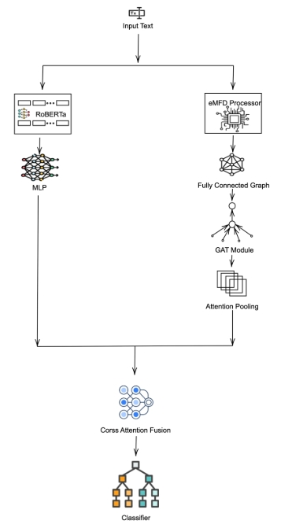
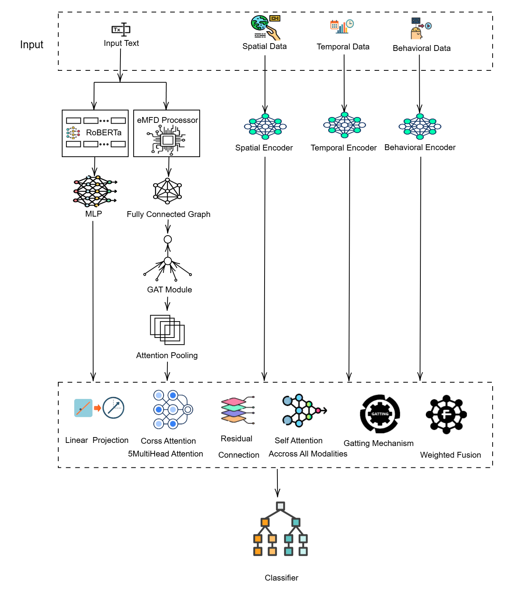

# Synergizing Contextual Semantics and Moral Knowledge Graphs for Moral Foundation Prediction

This repository contains the official implementation for the paper: **"Synergizing Contextual Semantics and Moral Knowledge Graphs: A Dual-Path Architecture for Moral Foundation Prediction"**.

Our work introduces a hybrid dual-path architecture that bridges the gap between interpretable lexicon-based methods and opaque LLMs by integrating a contextual encoder (ROBERTa-MLP) with a graph-based encoder (GAT-eMFD) that captures structured moral knowledge. This approach sets a new state-of-the-art on the MFTC and MFRC datasets. We further extend this into MOTIV, a five-modality framework for a more holistic analysis of moral expression.

## Key Features
- **Dual-Path Architecture**: A novel model that combines RoBERTa for deep contextual understanding and a Graph Attention Network (GAT) for structured moral-lexicon reasoning.
- **State-of-the-Art Performance**: Achieves a Macro F1-score of 0.69 on MFTC (a 3% improvement over the BERT baseline) and 0.40 on MFRC.
- **Multimodal Framework (MOTIV)**: Extends the dual-path model to a five-modality system incorporating textual, spatial, temporal, and behavioral data for richer, context-sensitive analysis.
- **Handling Class Imbalance**: Employs a multi-label Focal Loss function to effectively manage the severe class imbalance present in moral foundation datasets.
- **Reproducibility**: Provides details on data harmonization, model architecture, and training protocols to ensure results can be reproduced.

## Model Architecture

### 1. Dual-Path Model (for MFTC & MFRC)
The core of our model is a dual-path system that processes text through two parallel encoders:
1.  **Contextual Path**: A fine-tuned `roberta-base` model followed by a 2-layer MLP to generate a 256-dimensional contextual embedding from the input text.
2.  **Moral Concept Path**: An encoder that identifies moral concepts using the eMFD lexicon, builds a fully connected graph of these concepts, and uses a Graph Attention Network (GAT) to produce a 256-dimensional moral graph embedding.

These two pathways are fused using a cross-attention mechanism before being passed to a final classifier.



*Figure 2 from the paper, showing the dual-path architecture. You would replace the link with an actual uploaded image.*

### 2. MOTIV: A Five-Modality Framework
MOTIV extends the dual-path design by adding three more encoders for non-textual data:
- **Spatial Encoder**: An MLP to process county-level geospatial features.
- **Temporal Encoder**: A BiLSTM to process sequences of temporal data.
- **Behavioral Encoder**: An MLP for tweet engagement metrics like retweet count.

The five modality-specific embeddings are integrated using a heterogeneous fusion module that employs cross-attention, self-attention, and a gating mechanism.


*Figure 3 from the paper, showing the five-modality architecture. You would replace the link with an actual uploaded image.*

## Datasets
Our experiments leverage three primary corpora and one lexicon, which were harmonized into a unified five-foundation schema (plus a Non-Moral category).

- **MFTC (Moral Foundations Twitter Corpus)**: ~35,000 tweets annotated for moral sentiment across 7 domains.
  - **Access**: [Open Science Framework](https://osf.io/k5n7y/) 
- **MFRC (Moral Foundations Reddit Corpus)**: 16,123 Reddit comments from 12 morality-focused subreddits.
  - **Access**: [Hugging Face Datasets](https://huggingface.co/datasets/USC-MOLA-Lab/MFRC) 
- **MOTIV Dataset**: 1,483 geotagged tweets related to COVID-19 stay-at-home orders, enriched with spatial, temporal, and behavioral metadata.
  - **Access**: [Open Science Framework](https://osf.io/ygkzn/) 
- **eMFD (extended Moral Foundations Dictionary)**: A lexicon that maps words to probabilistic distributions across the five moral foundations.
  - **Access**: [Open Science Framework](https://osf.io/vw85e/) 


### Training the Model
To train the dual-path model on the MFTC dataset
The training process follows a multi-stage protocol to ensure stable integration of the encoders:
1.  **Stage 1**: Train the contextual path (ROBERTa-MLP) only.
2.  **Stage 2**: Train the moral concept path (GAT-eMFD) independently.
3.  **Stage 3**: Freeze the contextual path and train the fusion layer and classifier.
4.  **Stage 4**: Fine-tune all components (except the RoBERTa-MLP base) with a reduced learning rate.

## Performance

### MFRC and MFTC Results
Our full dual-path model (`ROBERTa + GAT (Full)`) demonstrates superior performance compared to baselines and ablated versions.

**Table: Model Performance on MFRC and MFTC (Macro F1-scores)** 
| Model | MFRC Macro F1 | MFTC Macro F1 |
| :--- | :---: | :---: |
| BERT (uncased) | 0.33 | 0.69 |
| ROBERTa + MLP | 0.30 | 0.66 |
| GAT (eMFD) | 0.13 | 0.30 |
| **ROBERTa + GAT (Full)** | **0.40** | **0.69** |

### MOTIV Results
The five-modality fusion model shows promise but also highlights the challenge of severe class imbalance for underrepresented foundations.

**Table: Per-Class F1-scores on MOTIV** [cite: 486]
| Class | F1-score |
| :--- | :---: |
| Care/Harm | 0.84 |
| Fairness/Cheating | 0.00 |
| Loyalty/Betrayal | 0.24 |
| Authority/Subversion | 0.20 |
| Purity/Degradation | 0.00 |
| Non-Moral | 0.25 |
| **Macro Avg.** | **0.25** |

## How to Cite
If you use this work, please cite the original paper:
```bibtex
 @article{P_2025,
title={Synergizing Contextual Semantics and Moral Knowledge Graphs: A Dual-Path Architecture for Moral Foundation Prediction},
url={http://dx.doi.org/10.22541/au.175440469.97011244/v1},
DOI={10.22541/au.175440469.97011244/v1},
publisher={Wiley},
author={P, Sam Sahil and Jamatia, Anupam and Chakma, Kunal},
year={2025},
month=aug }
```

## Acknowledgements
We sincerely thank the creators of the MFTC , MFRC , and MOTIV  datasets for making their work publicly available.

## License
This project is licensed under the MIT License. See the [LICENSE](LICENSE) file for details.
